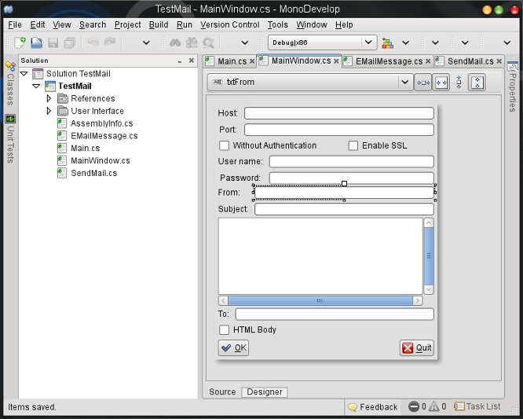
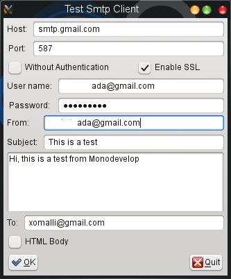
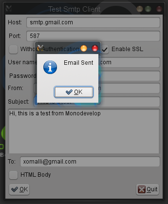
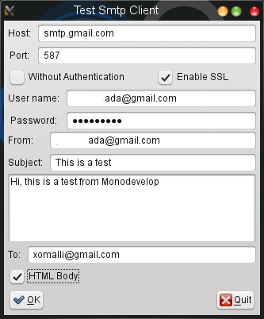
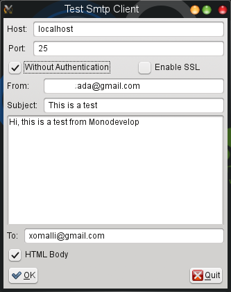
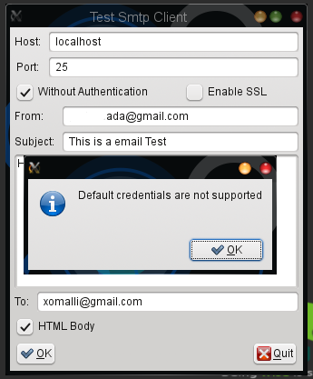

# Envio de e-mails vía SMTP con C# 

Uno de los requerimientos más comunes para las aplicaciones .NET es el envío de E-mails o correos electrónicos, entre los ejemplos mas usuales para este tipo de requerimiento se encuentran el envío automático automático de boletines electrónicos, notificaciones de eventos, bitácora del sistema, solicitudes de reunión, envío de archivos adjuntos entre otros.
.NET nos proporciona los ensamblados System.Net.Mail y System.Net.Mime, los cuales contienen todas las clases e interfaces necesarias para habilitar este tipo de requerimiento en cualquier aplicación .NET, a continuación describimos los elementos más importantes de estos ensamblados:

<ul>
<li>
<a href="http://msdn.microsoft.com/en-us/library/system.net.mail.mailmessage%28v=vs.80%29.aspx">MailMessage:</a>
</li> 
Representa un mensaje de correo electrónico, esta clase tiene todas las propiedades del mensaje por ejemplo: tema del mensaje, destinatario, destinatarios, remitente,cuerpo entre otras.
<li>
<a href="http://msdn.microsoft.com/en-us/library/system.net.mail.mailaddress%28v=vs.80%29.aspx">MailAdress:</a>
</li>
Representa una dirección de correo electrónico, esta clase ya implenta la lógica para validar que el formato sea correcto.
<li>
<a href="http://msdn.microsoft.com/en-us/library/system.net.mime.contenttype.aspx">ContentType:</a>
</li> 
Representa la cabecera del protocolo MIME
<li>
<a href="http://msdn.microsoft.com/en-us/library/system.net.mail.alternateview.aspx">AlternateView:</a>
</li>
Representa una vista alternativa del mensaje en un formato diferente al predeterminado, por ejemplo HTML ó Calendar.
<li>
<a href="http://msdn.microsoft.com/en-us/library/system.net.mail.smtpclient.aspx">SmtpClient:</a>
</li>
Esta clase se encarga de enviar el mensaje, aquí se establecen los parámetros de configuración del servidor SMTP, como: numero de puerto, usuario, password, SSL entre otros.
</ul>

Como ejemplo de la utilización de estas clases, mostramos un formulario  GTK# en Monodevelop que recibe los parámetros de configuración de un servidor SMTP, crea un mensaje de correo electrónico y lo envía hacia el o los destinatarios, utilizando dos clases: <em>EMailMessage</em> y <em>SendMail</em>.

El formulario en vista de diseño de MonoDevelop.
 

Básicamente el envió de correos electrónicos consiste de dos pasos:
Primero la creación del mensaje con sus adjuntos si es que los hubiese, de esta responsabilidad se encarga la clase <em>EMailMessage</em>, la cuál es una clase derivada de <em>MailMessage</em> y se establecen todos sus parámetros en el constructor.

<pre>
public EMailMessage (string subject,string fromField,List<string> to,string body,
bool isBodyHtml)
 {
	 Subject = subject;
	 From = new MailAddress(fromField);
	 foreach(string item in to) To.Add(new MailAddress(item));
	 IsBodyHtml = isBodyHtml;
	 if(IsBodyHtml)
	  Body = GetHTMLContent(body);
	 else
	  Body = body;
 }
</pre>

Como segundo paso, el envió del mensaje mediante un servidor SMTP. La clase <em>Sendmail</em> se ocupa de esta responsabilidad solicitando los parámetros de configuración del Server.

<pre>
public SendMail(string server,int port,bool enableSSL){
			 Server = server; 
			 Port = port;
			 EnableSSL = enableSSL;
	 }
 public SendMail(string server,int port,bool enableSSL,string username,string password): 
 this(server,port,enableSSL){
	 UserName = username;
	 Password = password;
	 Credentials = true;
 }
</pre>

Y después envía el mensaje con el siguiente método:

<pre>
	public void Send(MailMessage msg){
	 SmtpClient = new SmtpClient(Server,Port);
	 SmtpClient.EnableSsl = EnableSSL;
	 //DO NOT use: this property throws a Exception
	 //SmtpClient.UseDefaultCredentials = true;
	 if(Credentials){
	 SmtpClient.UseDefaultCredentials = false;
	 SmtpClient.Credentials = new NetworkCredential(UserName,Password);
 }
	 ServicePointManager.ServerCertificateValidationCallback = 
	 delegate(object s, X509Certificate certificate, X509Chain chain, SslPolicyErrors sslPolicyErrors) 
	 { return true; };
	 SmtpClient.Send(msg);
	 }
</pre>

En este método primeramente establecemos la configuración del servidor, indicamos si se usa o no una conexión segura, después en caso de requerir identificación establecemos el usuario y la contraseña, después utilizamos el delegado <em>ServerCertificateValidationCallback</em>  de la clase estática <a href="http://msdn.microsoft.com/en-us/library/system.net.servicepointmanager.aspx">ServicePointManager</a> para la validación del certificado del servidor. 
Luego de compilar, ejecutamos y probamos la aplicación  utilizando el servidor de correo <em>Gmail</em> en cuyo caso establecemos la configuración como: 
<strong>Host:</strong> smtp.gmail.com 
<strong>Port:</strong> 587 
<strong>Username:</strong> [user name]@gmail.com 
<strong>EnableSSL:</strong> true 

 

Si el envío resulta exitoso la aplicación nos mostrará el siguiente mensaje:

 

De forma predeterminada el mensaje se envia en texto plano, para enviar el mensaje en HTML, habilitamos el checkbox para activar la propiedad <em>IsBodyHtml</em> y recibir el mensaje en este formato.

 

Tambien podemos utilizar un servidor local SMTP en caso de que nuestra distribución <a href="http://www.opensuse.org/en/">OpenSuse</a> tenga instalados <i>Postfix</i> o <i>Sendmail.</i>

 

En el caso de no usar autentificación existe la propiedad <i>UseDefaultCredentials</i>  que funciona en el Framework .NET de Microsoft, no así en el Framework Mono, si la utilizamos, Mono lanzará una excepción como se muestra en la siguiente imagen:

 
